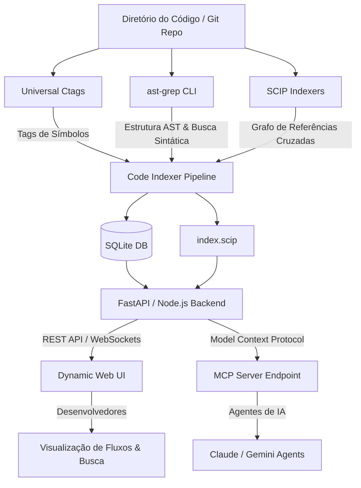

# Especificação Técnica: Sistema Independente de Inteligência de Código (Code Intelligence Engine)

Esta especificação descreve a arquitetura, o pipeline de dados e os requisitos de implantação para criar um serviço independente de indexação, navegação e busca de código. O sistema foi projetado para servir simultaneamente a **desenvolvedores humanos** (via uma interface web interativa) e **agentes de IA** (via Model Context Protocol - MCP).

---

## 1. Visão Geral da Arquitetura

O sistema é dividido em três camadas: **Coleta e Parsing** (Ctags, ast-grep, SCIP), **Serviço de Dados (Backend & DB)** e **Consumo (Web UI & MCP)**.



---

## 2. A Trindade da Indexação (Por que usar as 3 juntas?)

Cada ferramenta cobre uma fraqueza da outra, criando um ecossistema redundante e de alta performance:

| Ferramenta | O que indexa | Velocidade | Nível de Precisão | Papel no Sistema |
| :--- | :--- | :--- | :--- | :--- |
| **Universal Ctags** | Declarações globais (Funções, Classes, Interfaces, Constantes). | **Ultrarrápido** (Milissegundos) | Médio (Heurística de arquivo/linha) | **Cache de Símbolos Rápido:** Fornece o Outline lateral do arquivo instantaneamente. |
| **SCIP / LSIF** | Referências cruzadas exatas entre arquivos e dependências externas. | **Moderado** (Requer compilação/build do projeto) | **100% Preciso** (Resolução de tipos do compilador) | **Navegação de Fluxo ("Go to Def" / "Find All Refs"):** Garante que o clique em um método leve ao arquivo correto, mesmo que o método tenha o mesmo nome em classes diferentes. |
| **ast-grep** | Estruturas sintáticas e escopos lógicos (blocos de código). | **Rápido** (Segundos) | Alto (Respeita a árvore sintática da linguagem) | **Busca Estrutural & Extração de Contexto:** Permite isolar o corpo de um método ou fazer buscas como *"todas as funções assíncronas que não usam try/catch"*. |

---

## 3. Estrutura do Banco de Dados (SQLite)

Para manter o sistema leve e fácil de colocar em produção, utilizaremos um banco **SQLite** para unificar os índices e acelerar a filtragem da Web UI e das buscas de agentes.

```sql
-- Registro de Arquivos do Projeto
CREATE TABLE files (
    id TEXT PRIMARY KEY, -- Caminho relativo (ex: src/utils/db.ts)
    hash TEXT NOT NULL,  -- MD5 do conteúdo para atualização incremental
    language TEXT NOT NULL,
    size INTEGER NOT NULL,
    last_indexed_at TIMESTAMP DEFAULT CURRENT_TIMESTAMP
);

-- Tabela de Símbolos Rápidos (alimentada pelo Ctags)
CREATE TABLE symbols (
    id INTEGER PRIMARY KEY AUTOINCREMENT,
    file_id TEXT,
    name TEXT NOT NULL,
    kind TEXT NOT NULL, -- class, function, interface, variable
    line_start INTEGER NOT NULL,
    line_end INTEGER,
    signature TEXT,
    FOREIGN KEY(file_id) REFERENCES files(id) ON DELETE CASCADE
);

-- Grafo de Relações e Chamadas (alimentado por SCIP + ast-grep)
CREATE TABLE call_graph (
    id INTEGER PRIMARY KEY AUTOINCREMENT,
    caller_file TEXT NOT NULL,
    caller_symbol TEXT NOT NULL,
    callee_file TEXT NOT NULL,
    callee_symbol TEXT NOT NULL,
    call_line INTEGER NOT NULL,
    FOREIGN KEY(caller_file) REFERENCES files(id),
    FOREIGN KEY(callee_file) REFERENCES files(id)
);

-- Índice FTS5 para Busca Rápida de Símbolos por Termos
CREATE VIRTUAL TABLE symbols_fts USING fts5(
    name,
    signature,
    content='symbols',
    content_rowid='id'
);
```

---

## 4. Especificações da API do Backend

O backend deve expor endpoints REST simples para a interface Web e para o protocolo MCP.

### `GET /api/search`
Busca textual e por símbolos.
* **Query Params:**
  * `q`: Termo de busca (texto ou regex).
  * `type`: `text` (grep simples), `symbol` (busca no índice Ctags) ou `structural` (rodando query do `ast-grep`).
* **Response:**
  ```json
  {
    "results": [
      {
        "file": "src/services/auth.ts",
        "line": 42,
        "match": "export async function loginUser(credentials: Credentials)",
        "kind": "function"
      }
    ]
  }
  ```

### `GET /api/navigate/definition`
Retorna a definição exata de um símbolo a partir de uma chamada.
* **Query Params:**
  * `file`: Arquivo onde a chamada ocorre.
  * `line`: Linha do arquivo.
  * `character`: Posição do caractere na linha.
* **Response (Baseado no SCIP):**
  ```json
  {
    "definition": {
      "file": "src/database/connection.ts",
      "line_start": 12,
      "line_end": 35,
      "code_block": "class DBConnection { ... }"
    }
  }
  ```

### `GET /api/navigate/flow`
Gera a árvore de chamadas (Call Graph) em formato estruturado (Mermaid) de um determinado método.
* **Query Params:**
  * `symbol`: Nome do método/função (ex: `loginUser`).
* **Response:**
  ```json
  {
    "mermaid_graph": "graph TD\n  loginUser --> hashPassword\n  loginUser --> findUserByEmail\n  loginUser --> generateJWT"
  }
  ```

---

## 5. Arquitetura da Web UI (Frontend)

Uma interface dinâmica e navegável pode ser criada facilmente usando **React/Vite** ou **Next.js** com componentes modernos e leves.

### Componentes Chave da Interface:
1. **Painel Lateral Esquerdo (Tree View + Outline):**
   * Exibe a árvore de arquivos.
   * Quando um arquivo é selecionado, exibe uma lista rápida de símbolos (funções, classes) gerados pelo Ctags para navegação direta.
2. **Visualizador de Código Central (Monaco Editor em modo Read-Only ou Shiki/Prism):**
   * Destaque de sintaxe nativo.
   * **Hover Cards:** Ao passar o mouse sobre uma chamada (ex: `connectDb()`), abre um popup que busca o símbolo via `/api/navigate/definition` usando SCIP. Se o usuário clicar com `Ctrl+Click`, navega diretamente para o arquivo e linha da definição.
3. **Painel Direito (Call Graph Visualizador):**
   * Renderiza dinamicamente o fluxo gráfico de chamadas do método selecionado usando **Mermaid.js** ou **D3.js**.
   * O usuário pode clicar nos nós do gráfico para pular diretamente para a declaração de cada método.
4. **Painel de Busca Global (Superior):**
   * Barra de busca unificada com suporte a filtros rápidos (ex: `lang:typescript auth`) e buscas sintáticas estruturais via `ast-grep` (ex: `pattern: "try { $$$ } catch ($E) { $$$ }"`).

---

## 6. Integração com Agentes (Model Context Protocol - MCP)

O backend deve expor um servidor MCP integrado para que agentes externos possam consultar os mesmos índices que a Web UI:

```json
{
  "tools": [
    {
      "name": "search_symbols",
      "description": "Busca símbolos (funções, classes, variáveis) usando o índice rápido do Ctags.",
      "inputSchema": {
        "type": "object",
        "properties": {
          "query": { "type": "string", "description": "Nome do símbolo a buscar" }
        },
        "required": ["query"]
      }
    },
    {
      "name": "get_structural_matches",
      "description": "Busca padrões sintáticos no código utilizando ast-grep.",
      "inputSchema": {
        "type": "object",
        "properties": {
          "pattern": { "type": "string", "description": "Padrão de busca estrutural (ex: 'function $A($$$)')" }
        },
        "required": ["pattern"]
      }
    },
    {
      "name": "get_symbol_flow",
      "description": "Retorna o grafo de chamadas (quem chama e quem é chamado) por uma função.",
      "inputSchema": {
        "type": "object",
        "properties": {
          "symbol": { "type": "string", "description": "Nome da função a inspecionar" }
        },
        "required": ["symbol"]
      }
    }
  ]
}
```

---

## 7. Roteiro de Implantação e Produção (Production Deployment)

### 1. Preparação do Ambiente de Produção (CI/CD Pipeline)
Em seu pipeline de deploy (GitHub Actions, GitLab CI ou Runner local):
1. **Instalar Ctags & ast-grep:**
   ```bash
   sudo apt-get install universal-ctags
   npm install -g @ast-grep/cli
   ```
2. **Rodar Gerador de Índices no Build:**
   * Execute o `ctags` para gerar o arquivo inicial de tags:
     ```bash
     ctags -R --output=tags-file .
     ```
   * Instale o indexador SCIP da linguagem alvo (ex: `@sourcegraph/scip-typescript`) e gere o arquivo de grafo:
     ```bash
     scip-typescript index --project-root . --output index.scip
     ```
3. **Parsear e Popular o SQLite:**
   * Um script em Node.js ou Python lê o arquivo `tags-file` e o arquivo `index.scip`, estrutura os dados relacionais e os injeta no banco de dados SQLite (`production-index.db`).

### 2. Executando em Produção (Dockerfile do Serviço)
Para colocar o serviço no ar, utilize um Dockerfile contendo o backend da API e o arquivo SQLite pré-compilado:

```dockerfile
FROM node:20-alpine

# Instalar binário do ast-grep
RUN npm install -g @ast-grep/cli

WORKDIR /app

# Copiar dependências e código do servidor API
COPY package*.json ./
RUN npm ci --only=production
COPY . .

# Copiar os índices compilados no pipeline de CI/CD
COPY production-index.db ./database.db
COPY index.scip ./index.scip

EXPOSE 3000

CMD ["node", "dist/server.js"]
```

---

## 8. Considerações de Performance e Escalabilidade

* **Incrementalidade:** Em repositórios gigantes, recalcular o índice SCIP e Ctags a cada commit pode ser demorado. O pipeline de CI/CD deve verificar o hash dos arquivos modificados (usando o `git diff`) e atualizar incrementalmente apenas as linhas alteradas no banco SQLite.
* **Memória do Servidor:** Como o banco SQLite reside em disco e os arquivos SCIP são serializados de forma otimizada, a API consome menos de **200MB de RAM** sob carga pesada, tornando o projeto extremamente barato para hospedar em serviços como Render, Fly.io ou servidores VPS comuns.
